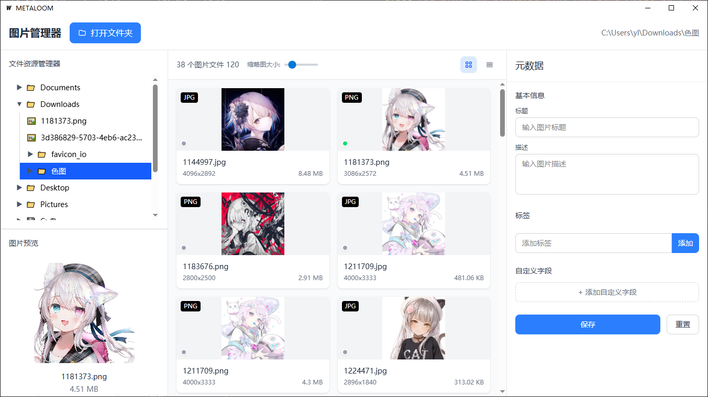

# 📂 Metaloom

**Metaloom** 是一款现代化的本地图片管理器，专注于高效预览、管理、筛选和标注图片资源。支持多种图片格式、文件夹导航、元数据编辑、缩略图浏览等功能。



---

## ✨ 功能特性

- 🖼️ **图片预览与缩略图视图**
  - 支持 JPG、PNG、GIF、WebP、BMP、TIFF 等主流格式
  - 自动生成缩略图，支持缩放控制

- 🗂️ **文件夹导航**
  - 快速浏览本地目录结构，双击打开文件夹
  - 目录树结构支持展开/收起

- 📝 **图片元数据编辑**
  - 可为图片添加标题、描述、标签、自定义字段
  - 所有数据以 xmp 形式存储

- ⚡ **性能优化**
  - 懒加载缩略图，避免卡顿
  - 多线程缩略图生成（使用 Go + goroutine 实现）

---

## 🧪 技术栈

| 模块 | 技术 |
|------|------|
| 前端 | Vue 3 + Vite + TypeScript + Tailwind CSS |
| 后端 | Go（Wails 框架） |
| 图片处理 | Go 标准库等 |
| 缓存存储 | 本地文件缓存 |

---

## 🖥️ 项目结构

metaloom/
├── frontend/ # Vue 3 前端项目
│ ├── components/
│ ├── views/
│ └── ...
├── services/ # Go 后端（Wails）
│ ├── assert_handler/
│ ├── app/
│ └── ...
├── cache/ # 缩略图缓存目录
└── README.md

## 🚀 快速开始

### 安装依赖

```bash
# 安装前端依赖
cd frontend
pnpm install
```

```bash
# 安装后端依赖
go install -v github.com/wailsapp/wails/v3/cmd/wails3@latest
```

### 运行项目

```bash
wails3 dev
```
